# 데이터베이스 설계/SQL 단위 평가 시험

## 문제 1: 데이터베이스 모델링 (25점)

**시나리오**

온라인 쇼핑몰을 위한 데이터베이스를 설계하고자 합니다. 이 쇼핑몰에서는 고객, 주문, 제품 정보를 관리해야 합니다. 고객은 여러 개의 주문을 할 수 있으며, 각 주문에는 여러 제품이 포함될 수 있습니다.

**문제**  
1. 아래 요구사항을 충족하는 각 테이블의 스키마를 정의하는 SQL DDL(Create Table) 문을 작성하세요. (25점)
    - **고객(Customer)**: 고객 ID, 이름, 이메일, 주소, 전화번호  
      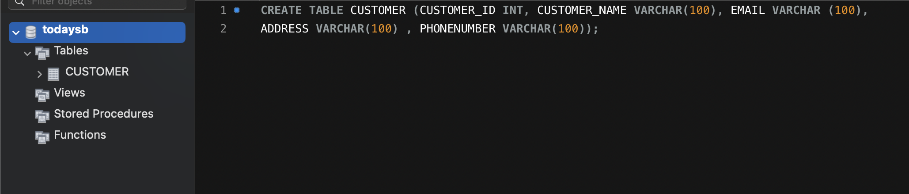
    - **제품(Product)**: 제품 ID, 이름, 가격, 재고  
      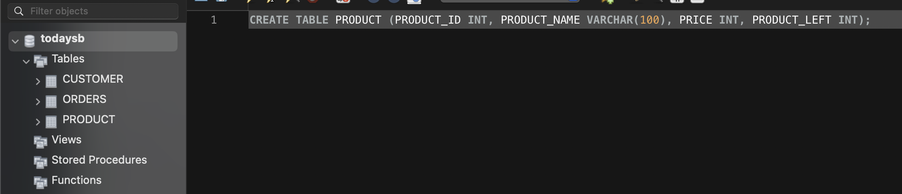
    - **주문(Order)**: 주문 ID, 고객 ID, 주문 날짜  
      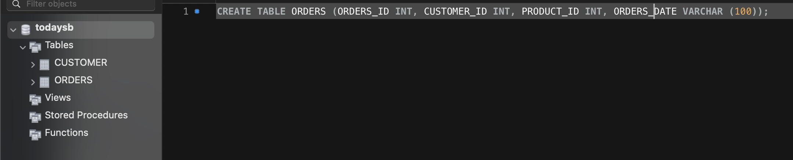
    - **주문 상세(Order_Detail)**: 주문 ID, 제품 ID, 수량, 단가  
      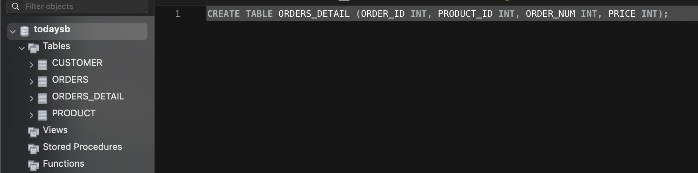

---

## 문제 2: 데이터 삽입 및 조회 (25점)

**시나리오**  
위에서 설계한 데이터베이스에 샘플 데이터를 삽입하고, 고객의 주문 내역을 조회하려고 합니다.

**문제**  
1. 각 테이블(Customer, Product, Order, Order_Detail)에 최소 2개의 샘플 데이터를 삽입하는 SQL INSERT 문을 작성하세요. (15점)  
    - 예시: 고객 2명, 제품 2개, 주문 2개, 각 주문당 2개의 제품 포함  
      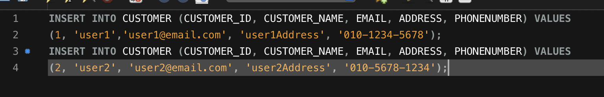  
      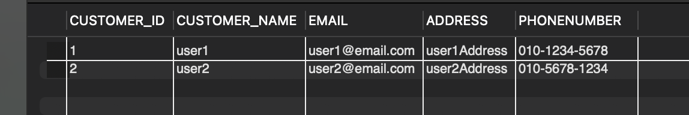  
      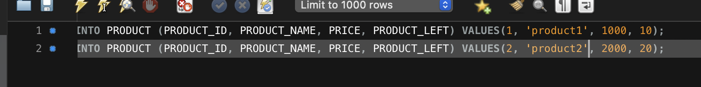  
      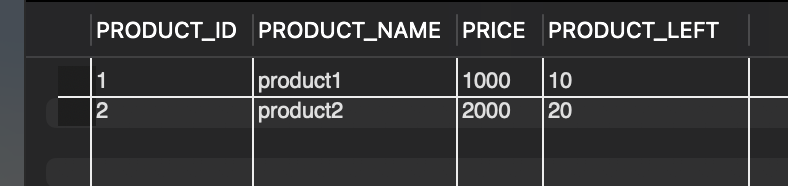

2. 특정 고객이 한 주문에 포함된 모든 제품과 그 수량을 조회하는 SQL SELECT 문을 작성하세요. (10점)  
    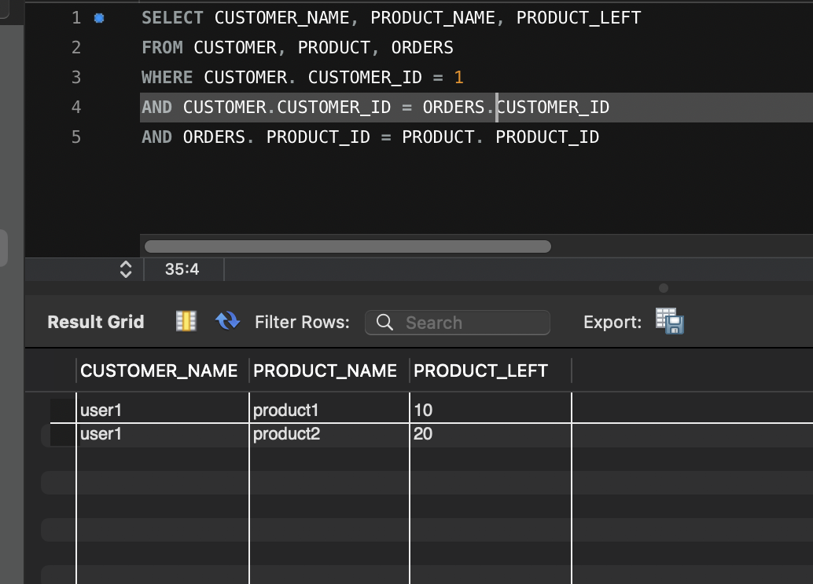

---

## 문제 3: 데이터 갱신 및 삭제 (20점)

**시나리오**  
고객의 주소가 변경되었으며, 특정 주문에 포함된 제품을 삭제하려고 합니다.

**문제**  
1. **데이터 갱신**: 고객의 주소를 변경하는 SQL UPDATE 문을 작성하세요. (10점)  
    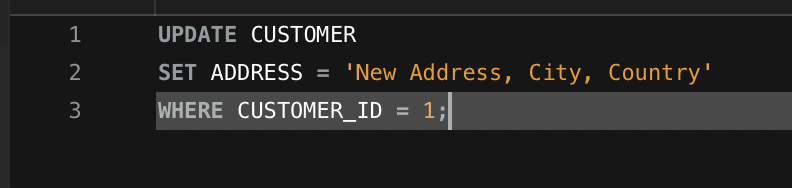

2. **데이터 삭제**: 특정 주문에 포함된 제품을 삭제하는 SQL DELETE 문을 작성하세요. (10점)  
    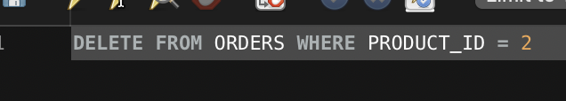

---

## 문제 4: JOIN을 활용한 데이터 조회 (30점)

**시나리오**  
쇼핑몰 관리자에게 주문에 포함된 모든 제품의 정보를 보여주는 보고서를 생성해야 합니다.

**문제**  
1. 각 주문에 포함된 제품의 이름, 수량, 단가, 총 금액(수량 * 단가), 그리고 주문 날짜를 조회하는 SQL JOIN 문을 작성하세요. (15점)  
    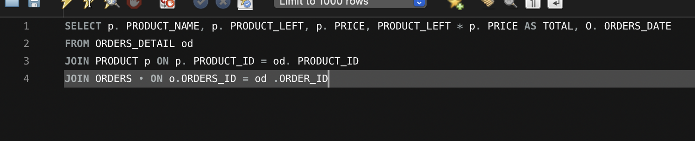

2. 각 고객의 이름과 그들이 총 몇 개의 제품을 구매했는지를 보여주는 SQL JOIN 문을 작성하세요. (15점)  
    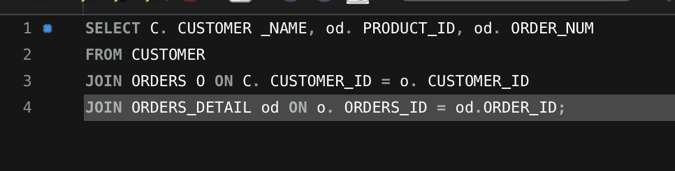

---

## 평가 기준

- **데이터베이스 모델링**: 관계형 데이터베이스 구조를 이해하며 적절한 테이블을 설계하는 능력.  
- **데이터 삽입 및 조회**: SQL INSERT 및 SELECT 문을 통해 데이터를 정확히 삽입하고, 원하는 데이터를 조회하는 능력.  
- **데이터 갱신 및 삭제**: SQL UPDATE 및 DELETE 문을 사용하여 데이터를 갱신하고 삭제하는 능력.  
- **JOIN을 활용한 데이터 조회**: SQL JOIN 문을 통해 여러 테이블 간의 관계를 이해하고, 복합적인 데이터를 정확히 조회하는 능력.
